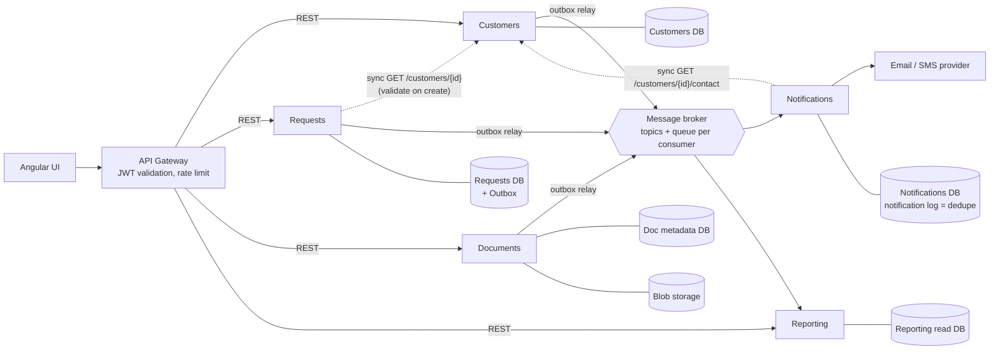

# Part B — Microservices architecture

Diagrams: [microservices-architecture.html](microservices-architecture.html) (services, APIs, broker; flow highlighting) · [data-flow.html](data-flow.html) (animated success/failure/retry scenarios).

## 1. Goal

Split the system into five services: Customers, Requests, Notifications, Documents, Reporting.
When a Request is created or its status changes, a notification must go out **even if Notifications is down at that moment**.

The core idea: a message queue plus idempotent consumers. Two details make it actually work:

1. **A queue alone is not enough.** If Requests commits to its DB and then crashes (or the broker is down) before publishing, the event is lost. This is the *dual-write* problem. Fix: **transactional outbox**.
2. **"Exactly once" doesn't exist on the wire.** Brokers deliver *at least once*; retries cause duplicates. **At-least-once delivery + idempotent consumer = effectively once.** That is what the idempotency check gives us.

## 2. Layout



**Rules**
- Each service owns its database. No service reads another service's tables.
- **Sync REST** only where the caller needs an answer *now* (validation, a lookup the user is waiting for).
- **Async events** for everything that is "this happened, react to it" (notifications, reporting, cross-service state).
- The gateway validates the JWT. Each service still **authorizes** from the token claims (`sub`, `role`). This replaces today's client-controlled `X-User-Id` / `X-Is-Admin` headers. Service-to-service calls use client-credentials tokens on the internal network.

## 3. Services

| Service | Owns | Sync API (main endpoints) | Publishes | Consumes |
|---|---|---|---|---|
| **Customers** | customers, contact details | `GET /customers/{id}`, `GET /customers/{id}/contact`, `POST/PUT /customers` | `CustomerUpdated` | — |
| **Requests** | requests, status history | `GET /requests` (search from Part A), `POST /requests`, `PATCH /requests/{id}/status` | `RequestCreated`, `RequestStatusChanged` | — |
| **Notifications** | notification log, inbox, user preferences | `GET /notifications?userId=` (history) | — | `RequestCreated`, `RequestStatusChanged` |
| **Documents** | file metadata; files in blob storage | `POST /requests/{id}/documents` → pre-signed upload URL, `GET /requests/{id}/documents` | `DocumentUploaded` | — |
| **Reporting** | denormalized read model | `GET /reports/...` | — | all of the above |

Notes:
- **Requests → Customers (sync):** on create, check that the customer exists. If Customers is down, creation fails fast with 503. Request creation needs a valid customer, so that's the honest answer.
- **Documents:** the client uploads straight to blob storage with a pre-signed URL, so file bytes never pass through the service.
- **Reporting** never calls other services at query time. It builds its own read model from events, so a heavy report can't load the operational DBs.

## 4. Reliable event flow (create / status change → notification)

```mermaid
sequenceDiagram
    participant C as Client
    participant R as Requests
    participant RDB as Requests DB
    participant Relay as Outbox relay
    participant MQ as Broker
    participant N as Notifications
    participant NDB as Notifications DB
    participant P as Email/SMS

    C->>R: PATCH /requests/42/status (Idempotency-Key)
    R->>RDB: BEGIN; UPDATE Request; INSERT Outbox(MessageId, RequestStatusChanged); COMMIT
    R-->>C: 200
    loop every ~1s
        Relay->>RDB: SELECT unpublished outbox rows
        Relay->>MQ: publish (persistent)
        MQ-->>Relay: ack
        Relay->>RDB: mark published
    end
    MQ->>N: deliver (queue holds it while N is down)
    N->>NDB: lookup Notification by MessageId (unique)<br/>Sent ⇒ duplicate, ack & skip · Pending ⇒ resend · none ⇒ INSERT Pending
    N->>P: send (provider idempotency key = Notification.Id)
    N->>NDB: mark Sent
    N-->>MQ: ack
```

### Event envelope
```json
{
  "messageId": "guid (the outbox row id, the dedupe key)",
  "type": "RequestStatusChanged",
  "occurredAt": "2026-10-02T10:00:00Z",
  "correlationId": "trace id from the original HTTP call",
  "requestId": 42,
  "version": 7,
  "data": { "requestNumber": "REQ-000042", "ownerId": 3, "assignedToId": 5, "oldStatus": "Open", "newStatus": "InProgress" }
}
```
- `messageId` is the idempotency key. It is set once, when the outbox row is written, so a republish carries the same id.
- `version` is a per-request counter that goes up on every change. Consumers ignore events with `version <= lastSeenVersion` for that request. This handles out-of-order delivery after retries (for example, "Closed" arriving before "InProgress").
- The event carries the data consumers need (fat event), so Reporting doesn't have to call back into Requests.

### Idempotency, per side
| Where | Mechanism |
|---|---|
| Client → Requests | `Idempotency-Key` header on POST/PATCH; stored with the response for 24h. A client retry returns the same result and doesn't create a second request. |
| Requests → broker | Outbox. The relay may publish twice (crash after publish, before "mark published"). That's fine, because consumers dedupe. |
| Broker → consumer (DB-only, e.g. Reporting) | Inbox table `(MessageId, Consumer)` PK, inserted **in the same transaction** as the consumer's own DB write. A failure rolls back both, so a redelivery is processed again. |
| Broker → Notifications | The `Notification` row (unique `MessageId + Channel`, status Pending/Sent) **is** the dedupe record. A plain inbox row committed before the send would be wrong: a redelivery after a failed send would look like a duplicate and the email would never go out. |
| Notifications → email provider | The external send can't be in our transaction. Write `Notification(Pending)` first, send with the provider's idempotency key = `Notification.Id`, then mark it Sent. Remaining gap: a crash between send and mark, on a provider without idempotency keys, can cause one duplicate email. Accepted, because a duplicate is better than a lost notification. |

## 5. Retry and resilience

**Consumers (async)**
1. **Immediate retries:** 3 attempts, about 200ms apart. Covers transient DB or network blips.
2. **Delayed redelivery:** 1m → 5m → 30m → 2h (exponential). Covers a dependency that's down (Customers, the email provider).
3. **Dead-letter queue:** after the last attempt. Raises an alert; an operator fixes the cause and replays from the DLQ.
4. **Poison messages** (can't deserialize, fail validation) go straight to the DLQ, with no retries. Retrying won't fix them.

**Sync HTTP calls** (`Microsoft.Extensions.Http.Resilience`, `AddStandardResilienceHandler`):
- Timeout per attempt, plus an overall timeout.
- Retry with exponential backoff and jitter, **only for idempotent calls** (GET, or POST with an Idempotency-Key).
- Circuit breaker: after repeated failures, stop calling for 30s and fail fast, instead of piling up threads.

**Back-pressure:** consumers use a prefetch/concurrency limit, so a backlog of 100k messages after an outage drains at a steady rate and doesn't flood the DB or the email provider.

## 6. Failure scenarios

| What fails | What happens | Data lost? |
|---|---|---|
| **Notifications down** | Events wait in its durable queue. When it comes back, it drains the backlog. | No |
| **Broker down** | Requests keeps working; outbox rows pile up. The relay publishes when the broker returns. | No |
| **Requests crashes right after commit** | The outbox row is committed. The relay publishes it on restart. | No |
| **Relay publishes twice** | Same `messageId`; Notifications finds the row already Sent and skips it, and Reporting's inbox rejects the copy. | No, and no duplicate |
| **Email provider down** | Consumer throws; delayed redelivery retries; DLQ plus an alert after about 2.5h. | No |
| **Customers down** | Creating a request returns 503 (fail fast). Notification lookups retry through redelivery. | No |
| **Status events arrive out of order** | `version` check drops the stale one. | No |
| **Reporting down** | Its queue buffers; the read model catches up later (eventual consistency). | No |

## 7. Technology choice

- **Broker:** RabbitMQ locally (Docker). In the cloud (Part C), a managed broker: Azure Service Bus or Amazon SQS/SNS. Both give durable queues, delayed retry and a DLQ out of the box.
- **Messaging library:** **MassTransit** with the EF Core transactional outbox + inbox. It implements the outbox relay, inbox dedupe, retry/redelivery policies and the DLQ, so we don't hand-write them. The mechanism above is what it does under the hood, which matters for explaining it.
- **Not Kafka:** we need per-message retry, a DLQ and fan-out to a few consumers, not a replayable high-throughput log. Kafka would add operational weight without benefit here.

## 8. Decision: transactional outbox (vs. alternatives)

| Option | Problem |
|---|---|
| Requests calls Notifications over HTTP | Notifications down means the notification is lost, or the user's request fails. This is exactly the requirement we must meet. |
| Publish to the broker right after `SaveChanges` | Dual write: a crash or broker outage between the two steps loses the event silently. |
| Distributed transaction (2PC) across DB + broker | Not supported by modern brokers or cloud DBs; slow and fragile. |
| CDC (Debezium reading the DB log) | Works, but adds Kafka Connect and Debezium infrastructure. Overkill for one service's events. |
| **Transactional outbox** ✅ | Event and data commit atomically in one local transaction. Costs one table and a relay (provided by MassTransit). |

## 9. Deliberately left out
- Saga/orchestration: no multi-service business transaction exists yet. Add it when, for example, "close request" has to coordinate Documents archiving.
- Event sourcing: the status-history table plus events is enough.
- A Notifications-side projection of customer contacts (to avoid the sync call to Customers): add it if Customers availability becomes a problem.
- Service mesh / mTLS: client-credentials tokens on a private network are enough at this size.
